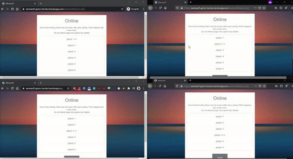

# CodeWere

A basic Flask app that allows user to play CodeNames, Werewolf or Cards Against Humanity via sockets. It is worth noting that this web app is as decentralised as possible, this created many unique issues but made the project much more interesting.

In the latest version players can now refresh in CAH, a feature that would previously break the games due to the decentralised architecture.

## Technologies

- Flask
- Flask-Socket-IO
- Eventlet
- jQeury
- Bootstrap

## Deployment

The app is hosted on heroku and uses Gunicorn as the web server.
<https://werewolf-game-heroku.herokuapp.com/>

## Screenshots

### Werewolf

### Cards Against Humanity

### CodeNames

